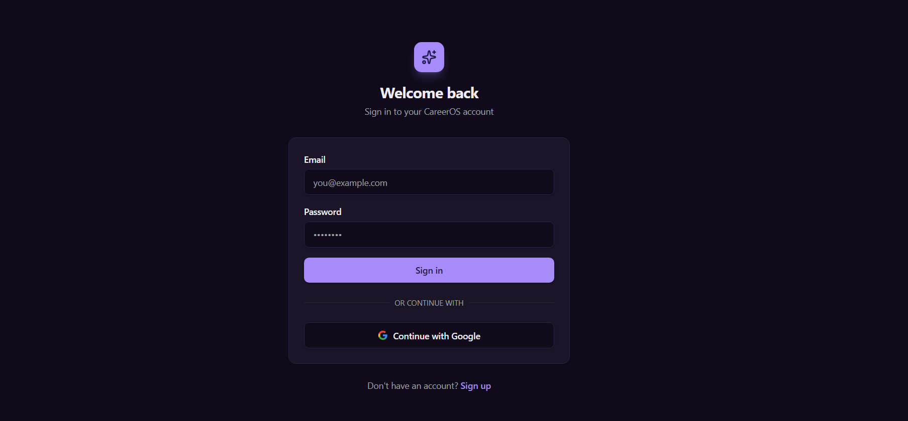
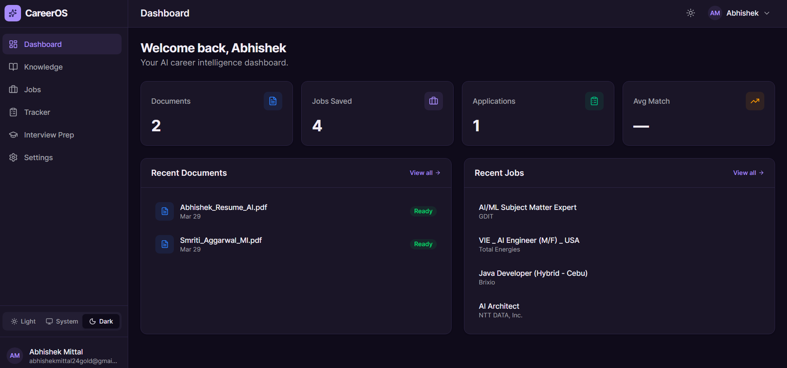
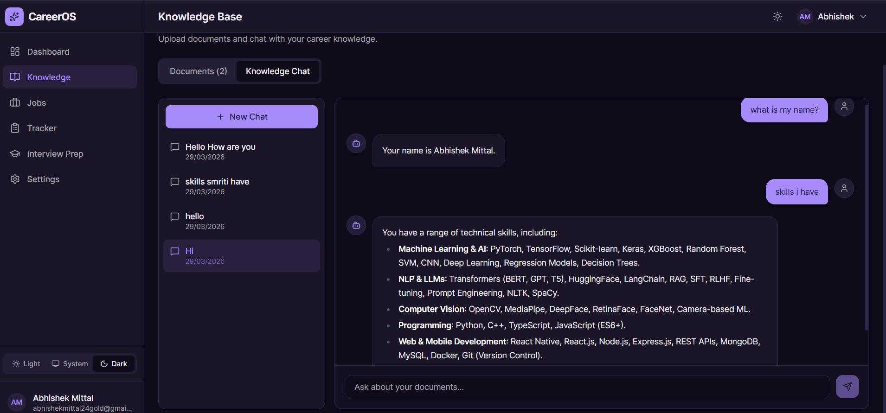
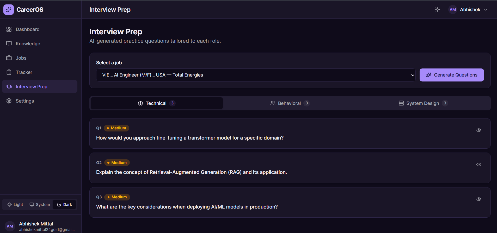
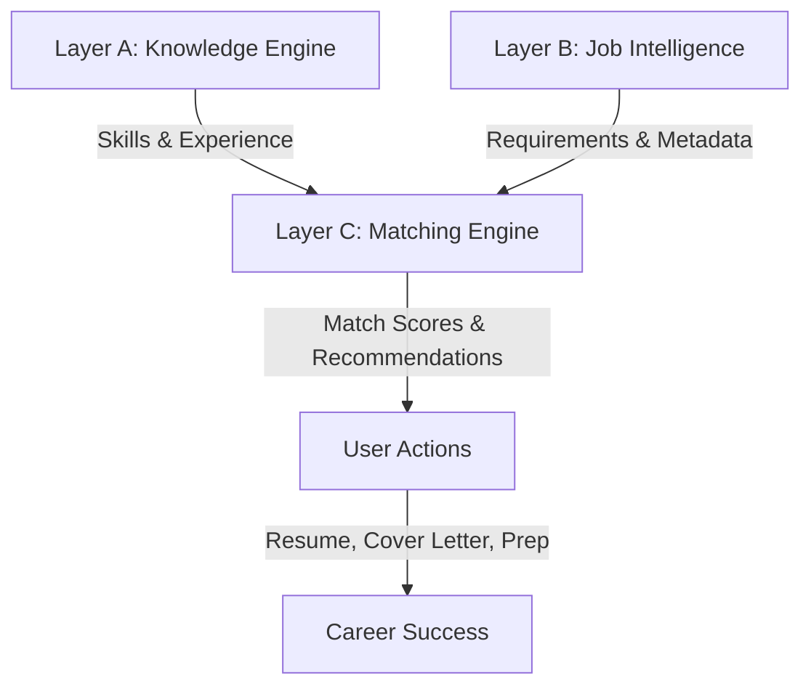

<div align="center">

# 🚀 CareerOS

**AI-Powered Career Intelligence Platform**

[](https://fastapi.tiangolo.com/)
[](https://reactjs.org/)
[](https://www.typescriptlang.org/)
[](https://www.postgresql.org/)
[](https://redis.io/)
[](https://openai.com/)

*Your intelligent workspace for career growth — understand your skills, find the perfect fit, and take action.*

[Features](#-features) • [Screenshots](#-screenshots) • [Getting Started](#-getting-started) • [Architecture](#-architecture) • [Tech Stack](#-tech-stack)

</div>

---

## 📖 About

**CareerOS** is an AI-powered job application assistant that revolutionizes your job search process. By combining a Personal Knowledge Engine with an intelligent Job Matching system, CareerOS answers three fundamental questions:

<div align="center">

| 🧠 **What do I know?** | 🎯 **Which job fits me best?** | 🚀 **What should I do next?** |
|------------------------|--------------------------------|-------------------------------|
| Extract and map your skills from documents | AI-powered job matching with detailed scoring | Generate personalized resumes, cover letters & prep guides |

</div>

Built with FastAPI, React, PostgreSQL (with pgvector), Redis, and OpenAI's GPT-4o, CareerOS streamlines your job search and increases your chances of landing your dream role.

---

## ✨ Features

### 🗂️ **Document Intelligence**
- **Smart Upload**: Drag-and-drop your resume, certificates, and projects
- **AI Extraction**: Automatically extract skills, experience, and education
- **Knowledge Chat**: Ask questions about your uploaded documents using RAG (Retrieval-Augmented Generation)

### 🎯 **Intelligent Job Matching**
- **Multi-Source Import**: Manually add jobs, paste job descriptions, or import from URLs
- **AI-Powered Scoring**: Get detailed match scores based on skills (40%), semantic fit (30%), projects (15%), education (10%), and location (5%)
- **Gap Analysis**: Identify missing skills and get actionable recommendations

### 📝 **Smart Content Generation**
- **Resume Tailoring**: Generate job-specific resume suggestions
- **Cover Letters**: Create personalized cover letters in seconds
- **Recruiter Emails**: Draft professional outreach messages
- **Learning Roadmap**: Get skill development plans for your target roles

### 📊 **Application Tracker**
- **Kanban Board**: Visual pipeline with 6 stages (Saved → Applying → Applied → Interview → Offer → Accepted/Rejected)
- **Deadline Management**: Track application deadlines and follow-ups
- **Status Tracking**: Monitor your entire job search in one place

### 🎓 **Interview Preparation**
- **Technical Questions**: Practice role-specific technical challenges
- **Behavioral Prep**: Get STAR-method question banks
- **System Design**: Prepare for architecture discussions
- **Company Research**: Organized prep materials for each application

---

## 📸 Screenshots

<details open>
<summary><b>🔐 Authentication</b></summary>
<br>

<p><i>Clean, modern authentication with email/password and Google OAuth support</i></p>
</details>

<details open>
<summary><b>🏠 Dashboard</b></summary>
<br>

<p><i>Comprehensive overview of your job applications, matched jobs, and recent activity</i></p>
</details>

<details open>
<summary><b>💬 Knowledge Chat</b></summary>
<br>

<p><i>Chat with your documents using AI-powered RAG for instant insights about your skills and experience</i></p>
</details>

<details open>
<summary><b>🎯 Interview Preparation</b></summary>
<br>

<p><i>Get personalized interview questions and preparation guides based on your target roles</i></p>
</details>

---

## 🏗️ Architecture

CareerOS is built on three core layers:



- **Layer A — Knowledge Engine**: Stores, indexes, and retrieves everything you know (documents, skills, projects)
- **Layer B — Job Intelligence**: Collects, scores, and manages job opportunities from multiple sources
- **Layer C — Matching Engine**: Uses embeddings + LLM reasoning to match your profile against jobs with transparent scoring

---

## 🛠️ Tech Stack

### Frontend
- **Framework**: React 19 + Vite 8
- **Language**: TypeScript
- **UI Library**: Tailwind CSS v4 + shadcn-inspired components
- **State Management**: Zustand + TanStack Query
- **Routing**: React Router v6
- **Rich Text**: TipTap (resume editor)
- **Charts**: Recharts (match score visualization)

### Backend
- **Framework**: FastAPI (Python 3.11+)
- **Auth**: JWT (python-jose) + Authlib (Google OAuth)
- **ORM**: SQLAlchemy 2.0 (async) + Alembic
- **Task Queue**: Celery + Redis
- **Document Processing**: PyPDF, python-docx, BeautifulSoup4

### Data Layer
- **Database**: PostgreSQL with pgvector extension
- **Cache**: Redis
- **Vector Search**: pgvector (1536-dimensional embeddings)
- **Storage**: Local filesystem (MVP) / S3-compatible for production

### AI Layer
- **LLM**: OpenAI GPT-4o
- **Embeddings**: text-embedding-3-small (1536 dims)
- **RAG Pipeline**: Custom implementation with semantic chunking
- **Token Management**: tiktoken

---

## 🚀 Getting Started

### Prerequisites

- **Node.js 20+**
- **Python 3.11+**
- **Docker & Docker Compose**

### 1️⃣ Clone the Repository

```bash
git clone https://github.com/yourusername/ApplyWise.git
cd ApplyWise
```

### 2️⃣ Start Database & Cache

```bash
docker-compose up -d postgres redis
```

This starts:
- PostgreSQL (with pgvector extension) on port **5432**
- Redis on port **6379**

### 3️⃣ Backend Setup

```bash
cd apps/api

# Create environment file
cp .env.example .env

# Install dependencies
pip install -r requirements.txt

# Run database migrations
alembic upgrade head

# Start the API server
uvicorn app.main:app --host 127.0.0.1 --port 8000
```

The API will be available at `http://localhost:8000`

**API Documentation**: Visit `http://localhost:8000/docs` for interactive Swagger UI

### 4️⃣ Frontend Setup

```bash
cd apps/web

# Install dependencies
npm install

# Start the dev server
npm run dev
```

The frontend will be available at `http://localhost:5173`

### 5️⃣ Configure Environment Variables

Open `apps/api/.env` and replace these required values:

| Variable | How to Get It | Required |
|----------|--------------|----------|
| `SECRET_KEY` | Generate: `python -c "import secrets; print(secrets.token_hex(32))"` | ✅ Yes |
| `OPENAI_API_KEY` | Get your key at https://platform.openai.com/api-keys | ✅ Yes |
| `GOOGLE_CLIENT_ID` | Create OAuth credentials at https://console.cloud.google.com/apis/credentials | ⚠️ Optional* |
| `GOOGLE_CLIENT_SECRET` | Same page as above | ⚠️ Optional* |

*\* Google OAuth is optional. Email/password authentication will work without these credentials.*

---

## 📁 Project Structure

```
ApplyWise/
├── apps/
│   ├── api/                          # FastAPI backend
│   │   ├── app/
│   │   │   ├── api/v1/               # API routes (auth, documents, jobs, etc.)
│   │   │   ├── core/                 # Config, security, dependencies
│   │   │   ├── models/               # SQLAlchemy models
│   │   │   ├── schemas/              # Pydantic schemas
│   │   │   ├── services/             # Business logic
│   │   │   │   ├── ingestion/        # Document processing & embedding
│   │   │   │   ├── rag/              # Retrieval-Augmented Generation
│   │   │   │   ├── matching/         # Job matching algorithm
│   │   │   │   └── generation/       # Content generation (resume, cover letter)
│   │   │   └── main.py               # Application entry point
│   │   ├── alembic/                  # Database migrations
│   │   ├── requirements.txt          # Python dependencies
│   │   └── .env.example              # Environment template
│   │
│   └── web/                          # React frontend
│       ├── src/
│       │   ├── pages/                # Route components
│       │   │   ├── auth/             # Login, Signup
│       │   │   ├── knowledge/        # Document upload + Knowledge Chat
│       │   │   ├── jobs/             # Job board + match scoring
│       │   │   ├── tracker/          # Application tracker (Kanban)
│       │   │   ├── prep/             # Interview preparation
│       │   │   └── settings/         # User settings
│       │   ├── components/           # Reusable UI components
│       │   ├── lib/                  # API clients, utilities, auth
│       │   ├── assets/               # Images, fonts, icons
│       │   └── main.tsx              # Application entry point
│       ├── package.json              # Node dependencies
│       └── vite.config.ts            # Vite configuration
│
├── docker-compose.yml                # PostgreSQL + Redis setup
├── IMPLEMENTATION_PLAN.md            # Detailed technical documentation
└── README.md                         # You are here!
```

---

## 🎯 Roadmap

### ✅ Phase 1 — Foundation (Completed)
- [x] Document ingestion & skill extraction
- [x] Knowledge chat with RAG
- [x] Job import & management
- [x] AI-powered match scoring

### ✅ Phase 2 — Engagement Layer (Completed)
- [x] Resume & cover letter generation
- [x] Application tracker (Kanban board)
- [x] Interview preparation suite

### 🔄 Phase 3 — Scale & Intelligence (Planned)
- [ ] Multi-user support with teams
- [ ] Browser extension for one-click job import
- [ ] Mobile app (React Native)
- [ ] Advanced analytics & insights
- [ ] Integration with LinkedIn, Indeed, Glassdoor
- [ ] AI interview coach with mock sessions
- [ ] Salary negotiation assistant

---

## 🤝 Contributing

Contributions are welcome! Please follow these steps:

1. **Fork the repository**
2. **Create a feature branch**: `git checkout -b feature/AmazingFeature`
3. **Commit your changes**: `git commit -m 'Add some AmazingFeature'`
4. **Push to the branch**: `git push origin feature/AmazingFeature`
5. **Open a Pull Request**

### Development Guidelines

- Follow existing code style and conventions
- Write meaningful commit messages
- Add tests for new features
- Update documentation as needed
- Ensure all tests pass before submitting PR

---

## 📄 License

This project is licensed under the **MIT License** - see the [LICENSE](LICENSE) file for details.

---

## 🙏 Acknowledgments

- **OpenAI** for GPT-4o and embedding models
- **FastAPI** for the amazing Python web framework
- **React** and the entire modern frontend ecosystem
- **shadcn/ui** for beautiful UI component patterns
- **pgvector** for enabling vector search in PostgreSQL

---

## 📞 Contact & Support

- **Issues**: [GitHub Issues](https://github.com/abhishekmittal/ApplyWise/issues)
- **Discussions**: [GitHub Discussions](https://github.com/abhishekmittal/ApplyWise/discussions)
- **Email**: abhishek.mittal@example.com

---

<div align="center">

**Built with ❤️ by Abhishek Mittal**

⭐ Star this repo if you find it helpful!

</div>
